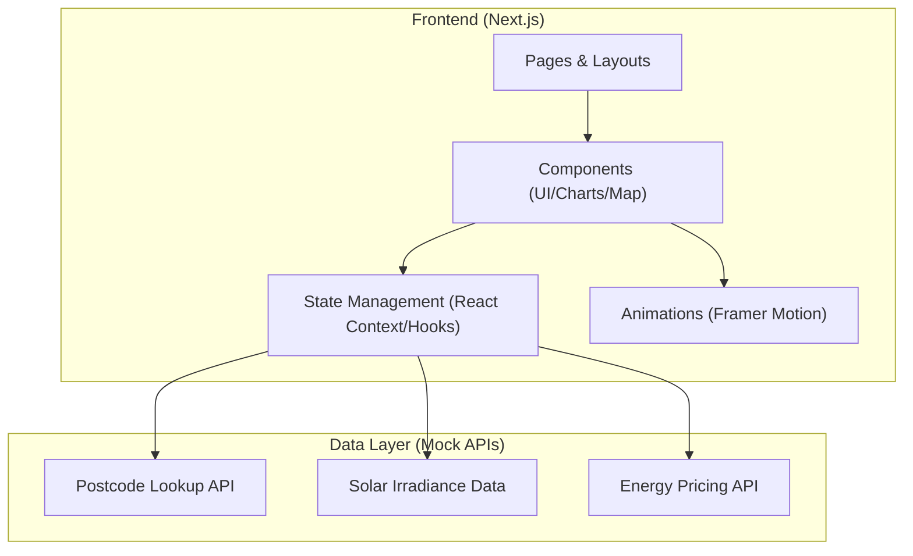
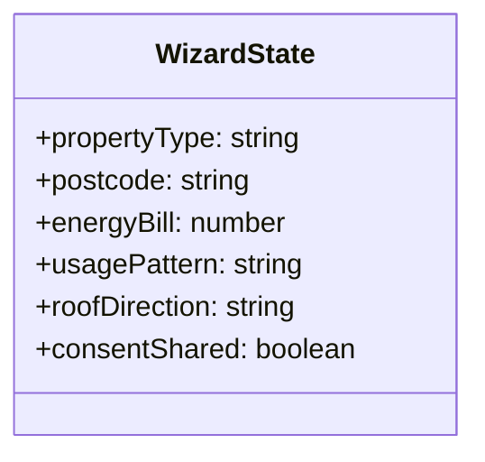

## 1. Architecture Design



## 2. Technology Description
- **Framework**: Next.js 14+ (App Router)
- **Styling**: Tailwind CSS
- **Components**: Radix UI (Headless) + Custom Components
- **Animations**: Framer Motion
- **Data Visuals**: Recharts
- **Maps**: React-Leaflet or Custom SVG Map (depending on interactivity requirements)
- **Icons**: Lucide React
- **Initialization**: `npx create-next-app@latest`

## 3. Route Definitions
| Route | Purpose |
|-------|---------|
| `/` | Home page with hero, map, and overview |
| `/wizard` | Multi-step solar savings wizard |
| `/results` | Personalized savings and ROI dashboard |
| `/education` | Education hub and advice articles |
| `/installers` | Vetted installer directory |
| `/business` | Commercial solar landing page |

## 4. API Definitions (Mock)
### 4.1 Postcode Data
```typescript
interface PostcodeInsight {
  postcode: string;
  avgInstallCost: number;
  avgSunlightHours: number;
  avgBillSavings: number;
  paybackPeriodYears: number;
}
```

### 4.2 Savings Forecast
```typescript
interface SavingsForecast {
  annualGeneration: number;
  annualSavings: number;
  co2Offset: number;
  roiPercentage: number;
  projection10Years: Array<{ year: number; savings: number }>;
}
```

## 5. Data Model
### 5.1 Wizard State

