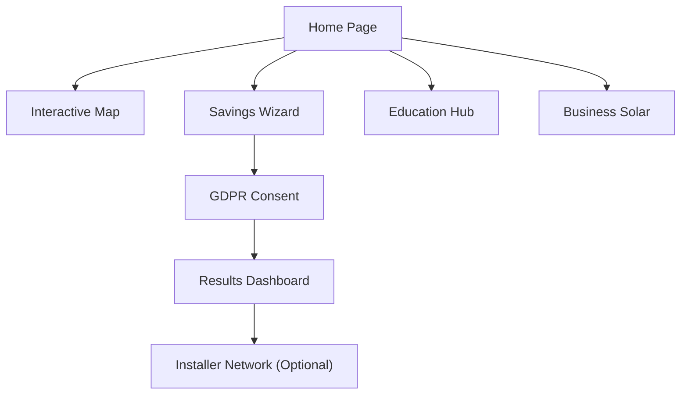

## 1. Product Overview
Solarpedia is a premium, impartial UK solar advice platform inspired by Which?. It provides homeowners and businesses with data-driven guidance on solar energy suitability, costs, and savings without sales pressure.
- **Problem**: Users face biased, lead-gen focused solar information.
- **Solution**: A transparent, data-first platform for independent solar insights and savings forecasts.

## 2. Core Features

### 2.1 Feature Module
1. **Home Page**: Hero section, quick value bar, interactive UK map, education hub, trust & transparency section.
2. **Solar Savings Wizard**: Multi-step data collection for personalized estimates.
3. **Results Page**: Comprehensive savings dashboard with ROI charts and system recommendations.
4. **Installer Network**: Vetted directory of qualified solar installers.
5. **Business Solar**: Dedicated landing page for commercial solar ROI and tax benefits.

### 2.2 Page Details
| Page Name | Module Name | Feature description |
|-----------|-------------|---------------------|
| Home Page | Hero Section | "Find out if solar is actually worth it" headline with savings dashboard visuals. |
| Home Page | Interactive Map | UK map with heatmap overlays for costs, ROI, and efficiency by postcode. |
| Wizard | Savings Wizard | Multi-step form (Property type, bill, roof size) with calm, professional UX. |
| Results Page | Savings Dashboard | Interactive Recharts for 10-year projections, monthly savings, and ROI. |
| Education Hub | Knowledge Base | Editorial-style articles on myths, battery storage, and financing. |
| Business Solar | ROI Calculator | Specialized tools for warehouse/factory energy independence projections. |

## 3. Core Process
1. User enters site and sees high-level UK solar data.
2. User uses the "Interactive Map" to see regional trends.
3. User starts the "Savings Wizard" to input property specifics.
4. User completes the GDPR consent step (checked for accuracy, unchecked for generic).
5. User views the "Results Page" with detailed financial and environmental forecasts.
6. User optionally explores the "Installer Network" or "Education Hub".

## 4. User Interface Design
### 4.1 Design Style
- **Aesthetic**: Premium fintech dashboard meets editorial advice publication.
- **Palette**: Deep Navy (Trust), Warm White (Cleanliness), Soft Yellow (Energy/Accents), Muted Greens (Sustainability).
- **Typography**: Large, high-readability serif/sans-serif pairing (e.g., Playfair Display for headers, Inter for body).
- **Components**: Rounded cards, subtle shadows, generous whitespace.
- **Animations**: Framer Motion for smooth transitions and staggered reveals.

### 4.2 Page Design Overview
| Page Name | Module Name | UI Elements |
|-----------|-------------|-------------|
| Home Page | Hero Section | Clean layout, dashboard illustration, Savings/ROI mini-graphs. |
| Home Page | Quick Value Bar | Horizontal cards with live-ticker feel for average costs/savings. |
| Wizard | Step UI | Progress bar, icon-based selectors, sliders for energy bills. |
| Results | Data Visuals | Donut charts for energy mix, line charts for ROI, carbon offset visuals. |

### 4.3 Responsiveness
- Desktop-first design with a focus on large screen readability.
- Fully fluid mobile-adaptive layout with touch-optimized wizard controls.
